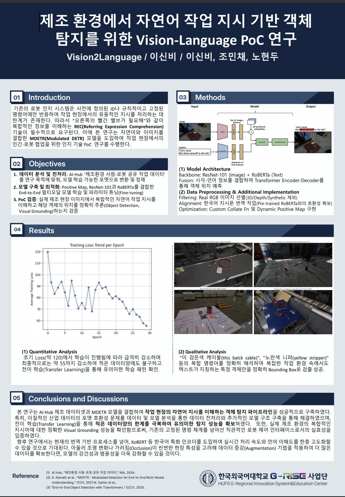
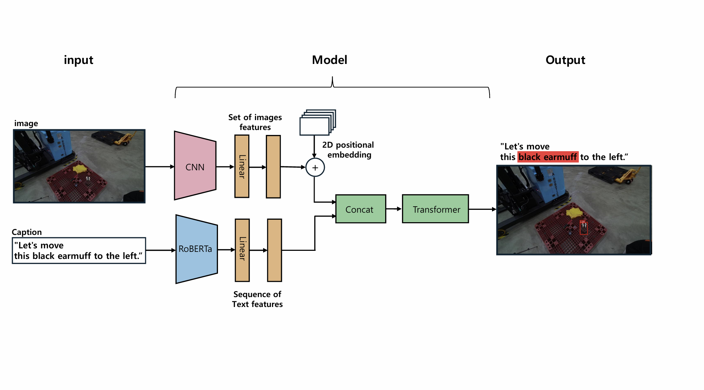

# 🏭 자연어 지시 기반 객체 탐지를 위한 Vision-Language 모델 PoC 연구
### G-RISE 2025 지산학 얼라이언스 고도화 지역 산업군 PoC 연구 (Vision2Language 팀) / 장려상 수상작 <br>
> **Task:** Referring Expression Comprehension (REC) in Manufacturing Environment


>  

## 💡 1. Project Overview
현대 제조 및 물류 현장에서는 인간과 로봇이 공간을 공유하며 협업한다. 하지만 기존의 로봇 인지 시스템은 고정된 명령어에만 의존하여, "오른쪽의 검은색 귀덮개를 치워주세요"와 같은 유동적이고 복잡한 자연어 지시를 처리하는 데 한계가 있다. 본 프로젝트는 자연어(Text)와 시각 정보(Image)를 동시에 이해하는 **MDETR(Modulated DETR)** 모델을 도입하여, 작업자의 복합적인 자연어 명령을 이해하고 해당 객체의 위치를 정확히 파악(Visual Grounding)하는 Vision-Language 객체 탐지 파이프라인의 현장 적용 가능성(PoC)을 검증한다.

## 📊 2. Dataset
* **출처:** [AI-Hub 제조환경 사람-로봇 공유 작업 데이터](https://aihub.or.kr/)
* **데이터 전처리 (Data Engineering):**
  * **Filtering:** 범용성 확보를 위해 3D CAD, Depth Map 데이터를 제외하고 **Real RGB 이미지**만 선별
  * **Alignment:** 사전 학습된 텍스트 인코더(RoBERTa)와의 호환성을 위해 한국어 지시문을 영어로 번역 및 정제
  * **Normalization:** 다양한 해상도에 강건하게 대응하기 위해 Bounding Box 절대 좌표를 상대 비율 좌표(0.0~1.0)로 정규화

## 🧠 3. Model Architecture
* **Image Encoder:** `ResNet-101` (이미지 시각적 특징 추출)
* **Text Encoder:** `RoBERTa-base` (자연어 지시문 문맥 임베딩)
* **Fusion:** 시각/언어 정보를 결합(Concatenate)하여 Transformer Encoder-Decoder를 통해 객체 위치와 텍스트 매핑 동시 예측
>  

## 🔥 4. Key Technical Contributions 
> 💡 이질적인 산업용 데이터셋을 모델에 적용하기 위해 **데이터 로딩 및 학습 파이프라인을 독자적으로 재설계**

### 1️⃣ Custom Collate Function 구현 
* **Problem:** 가변적인 길이의 텍스트 캡션과 다양한 해상도의 이미지를 기본 `DataLoader`로 배치(Batch) 처리할 때 텐서 크기 불일치(TypeError) 발생
* **Solution:** 이미지와 타겟은 패딩(Padding)과 마스크를 포함한 `NestedTensor`로 변환하고, 텍스트는 시퀀스 길이를 동적 정합하는 **Custom Collate Function**을 자체 구현하여 안정적인 배치 학습 환경 구축

### 2️⃣ Dynamic Positive Map 동적 생성
* **Problem:** MDETR 학습을 위해서는 '텍스트의 특정 단어'와 '정답 박스' 간의 매핑 정보(Positive Map)가 필수적이나, 원본 데이터에는 해당 라벨링 부재
* **Solution:** 학습(Runtime) 단계에서 텍스트 토큰과 대상 객체 간의 대응 관계를 추론하여 **Positive Map을 실시간으로 동적 생성하는 로직**을 추가. 이를 통해 모델이 텍스트-객체 간의 연관성(Alignment)을 인지하도록 최적화

### 3️⃣ 경로 정합성 확보 (Path Alignment)
* **Problem:** JSON 메타데이터 상의 경로와 실제 서버 내 물리적 경로 불일치로 인한 `FileNotFoundError` 발생
* **Solution:** 디렉터리 전수 확인 및 Re-mapping 스크립트를 적용하여 데이터 로딩 오류 100% 해결

## 📈 5. Results 

### Quantitative Analysis (정량적 분석)
* 제한된 산업 데이터에서도 전이 학습(Transfer Learning)을 통해 초기 Loss(약 120)에서 최종적으로 **약 55 수준까지 급격히 하향 안정화**되며 성공적인 수렴 확인

### Qualitative Analysis (정성적 분석)
* "이 검은색 케이블(this black cable)", "노란색 니퍼(yellow stripper)" 등 **색상, 속성, 위치 정보가 포함된 복합 명령어**를 정확히 해석하여 복잡한 환경 속에서도 타겟 객체만을 정확히 Bounding Box로 검출 성공

## 🚀 6. Future Work
* **한국어 특화 모델 도입:** 현재의 번역 기반 프로세스를 넘어, `KoBERT` 등 한국어 특화 인코더를 적용하여 실시간 처리 속도 및 지시어 이해도 향상
* **강건성(Robustness) 개선:** 조명 변화, 객체 가려짐(Occlusion) 등 현장 변수에 대응하기 위한 데이터 증강(Augmentation) 기법 도입

## 📁 Repository Structure
*(데이터 및 체크포인트는 보안상 제외)*
```text
├── dataset_preparation/     # 데이터 전처리 및 포맷 변환 스크립트 (경로 리매핑 등)
├── models/                  # MDETR 아키텍처 및 핵심 로직
├── utils/
│   ├── collate_fn.py        # Custom Collate Function 구현부 ⭐
│   └── positive_map.py      # Dynamic Positive Map 생성 로직 ⭐
├── train.py                 # 학습 실행 스크립트
├── inference.py             # 추론 및 시각화 스크립트
└── README.md
```

## 🧑‍💻 Team "Vision2Language"
이신비 (한국외대 컴퓨터공학부 24학번) - Project Lead, Server Setting, Data Preprocessing, Model Training

노현두 (한국외대 컴퓨터공학부 22학번) - Results Analysis & Visualization

조민채 (한국외대 컴퓨터공학부 23학번) - Env Setup, Pipeline Engineering & Evaluation

## References
[Dataset] AI Hub, 제조환경 사람-로봇 공유 작업 데이터 (2024)

[Paper] MDETR - Modulated Detection for End-to-End Multi-Modal Understanding (ICCV 2021)
